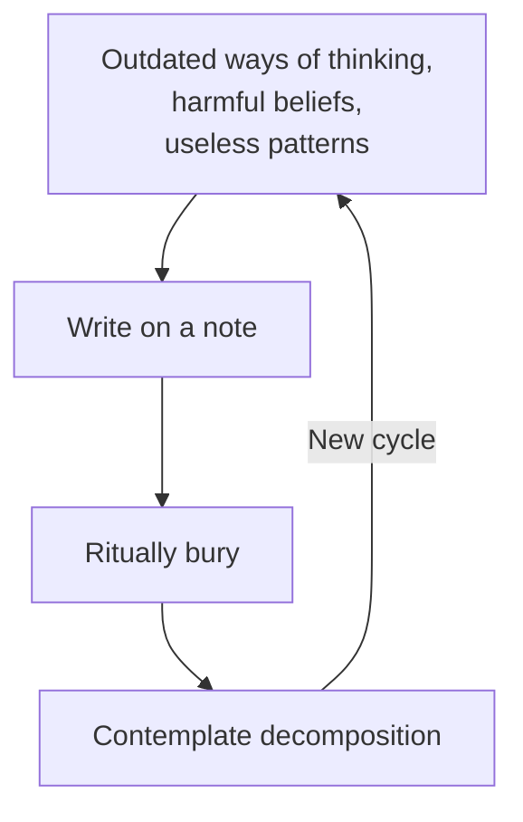

Ecofeminist composting is the practice of transforming outdated, harmful, and colonial ways of thinking and living, which, along with organic matter, decompose in a compost heap, thereby creating fertile ground and transformed thought patterns.

### 1. Composting Superfluous Ways of Thinking and Living

## 1.1. Preparation

Find a physical compost heap or bin in your garden or a community garden, or alternatively, use a flowerpot with soil. You will also need paper and a pen. To deepen your reflection, you can prepare by watching recommended videos beforehand.

{{youtube wvpFyuHpxgQ}}

{{vimeo 1099398335}}

## 1.2. What will you compost?

Take a few moments to focus. Breathe deeply and concentrate on performing the practice. Which outdated ways of thinking, harmful beliefs, or unhelpful patterns do you wish to compost? These can be personal, such as self-doubt, fear, or limiting beliefs. They can also be related to broader societal issues, such as internalized racism, sexism, or anthropocentrism.

### 1.2.1. Write the superfluous on a note

Once you have identified exactly what you intend to compost, write it down on a note. You can write words, phrases, sentences, or even draw symbols that represent these thoughts and patterns. By writing them down, we externalize these internal processes, giving them a form outside ourselves. This is an act of intention and commitment to transformation. You might feel relief, sadness, or even resistance. Acknowledge these feelings and focus on your intention.

## 1.3. Ritual burial

Take your piece of paper with the written thoughts to your compost heap or pot with soil. Bury the note deep in the compost. You can tear it into smaller pieces to help it decompose more easily. During the ritual burial, visualize how, alongside the organic matter in the compost, your old thoughts and patterns are also breaking down. Imagine microorganisms and other decomposers doing their work, transforming "waste" or "remains" into something fertile, into the substance of future life, into possibilities that are currently unrecognizable. This is a symbolic act, but it holds real power in connecting our internal processes with the Earth's natural cycles.

### 1.2.3 Contemplation of decomposition

Trust in the generative potential of the compost you have helped to create. This reflection is an integral part of the practice, and of course, a single execution is not enough. After some time, you can return to your chosen compost heap, observe the process of decomposition and regeneration, and repeat the entire procedure if necessary to bid farewell to any remaining colonial or limiting beliefs.