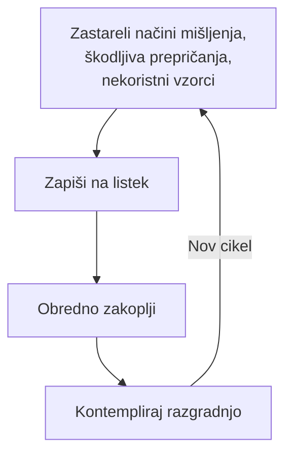

Ekofeministično kompostiranje je praksa **presnavljanja zastarelih, škodljivih in kolonialnih načinov mišljenja in bivanja**, ki se skupaj z organskimi snovmi razgradijo v kompostnem kupu, s čimer ustvarjamo plodna tla in preobražene miselne vzorce.

# 1. Kompostiranje odvečnih načinov mišljenja in bivanja

## 1.1. Priprava

**Poišči fizično kompostno gomilo ali posodo** na dvorišču, v skupnostnem vrtu ali pa uporabi kot nadomestek cvetlični lonec s prstjo. Potrebuješ še papir in pisalo. Za poglobitev refleksije se lahko predhodno pripraviš z ogledom priporočenih posnetkov.

{{youtube https://youtu.be/wvpFyuHpxgQ?si=I_gMhaZQPsJg9s0S}}

{{vimeo https://vimeo.com/1099398335}}

## 1.2. Kaj boš kompostirala_?

Vzemi si nekaj trenutkov, da se osredotočiš. Globoko dihaj in se ozredotoči na izvajanje prakse. **Katere zastarele načine mišljenja, škodljiva prepričanja ali nekoristne vzorce želiš kompostirati?** Lahko so osebni, na primer dvom vase, strah ali omejujoča prepričanja. Lahko so povezani tudi s širšimi družbenimi vprašanji, kot so internaliziran rasizem, seksizem ali antropocentrizem. 

### 1.2.1. Zapiši odvečno na listek

Ko ugotoviš, kaj točno nameravaš kompostirati, **to zapiši na listek.** Lahko napišeš besede, fraze, stavke ali celo narišeš simbole, ki predstavljajo te misli in vzorce. S pomočjo zapisovanja te notranje procese eksternaliziramo, da jim damo obliko zunaj nas samih. To je dejanje z namero in zavezanostjo preobrazbi. Morda boš občutila_ olajšanje, žalost ali celo odpor**.** Prepoznaj občutenja in se osredotoči na svojo namero.

## 1.3. Obredno zakopavanje

Vzemi svoj kos papirja z zapisanimi mislimi na svojo kompostno gomilo ali lonec s prstjo. **Zakoplji listek globoko v kompost.** Lahko ga raztrgaš na manjše koščke, da bo lažje razpadel. Med obrednim zakopavanjem si **vizualiziraj, kako se kot poleg organskih snovi v kompostu razgrajujejo tudi stare misli in vzorci.** Predstavljaj si, kako mikroorganizmi in drugi razgrajevalci opravljajo svojo nalogo, preoblikujejo »odpadke« ali »ostanke« v nekaj plodnega, v snov prihodnjega življenja, v možnosti, ki so ta hip še nerazpoznavne. To je simbolno dejanje, vendar ima dejansko moč v povezovanju naših notranjih procesov z naravnimi cikli Zemlje.

### 1.2.3 Kontemplacija razgradnje

Zaupaj generativnemu potencialu komposta, ki si ga pomagala_ ustvariti. Ta refleksija je sestavni del prakse, pri čemer seveda ne zadošča samo ena izvedba. Čez nekaj časa se lahko vrneš k izbranemu kompostnemu upu, opazuješ proces razgradnje in regeneracije ter po potrebi ponoviš celoten postopek, da se posloviš še od preostalih kolonialnih ali omejujočih prepričanj.